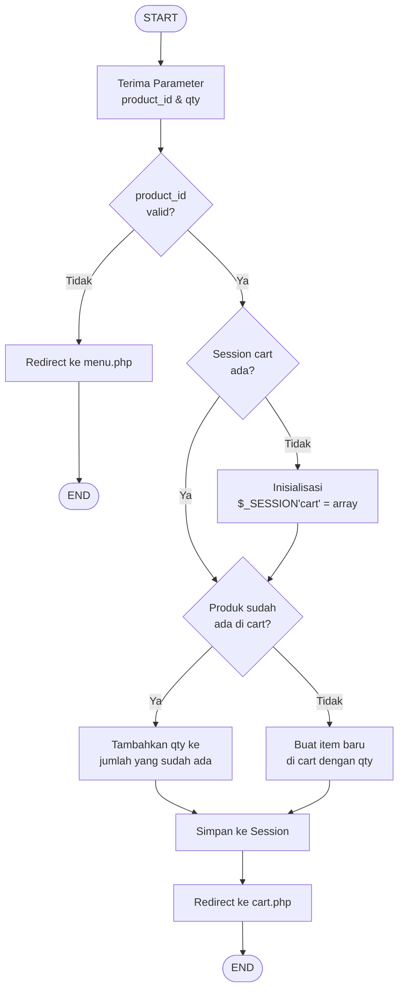
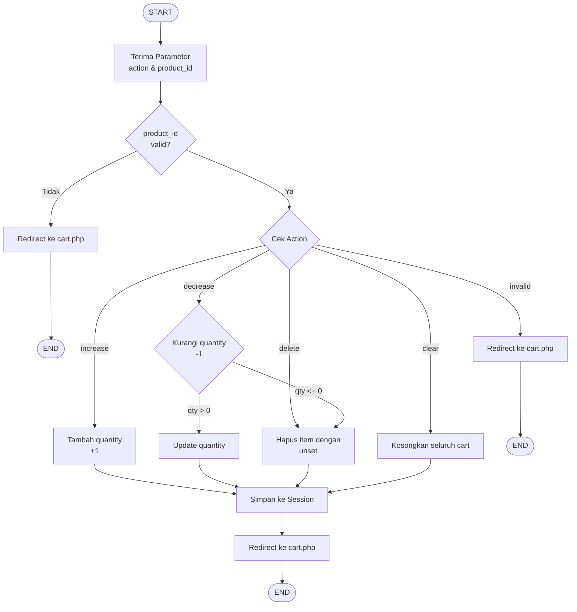
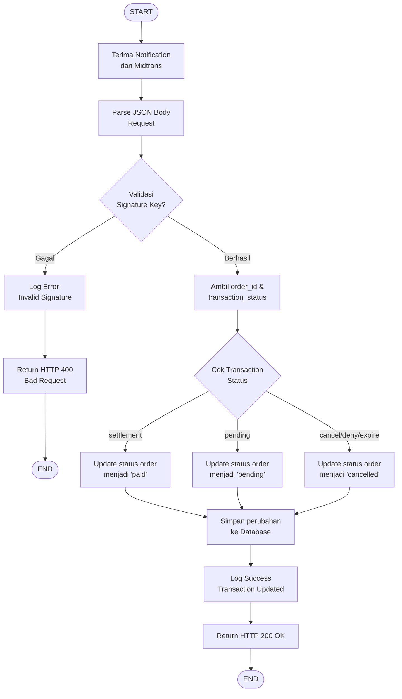
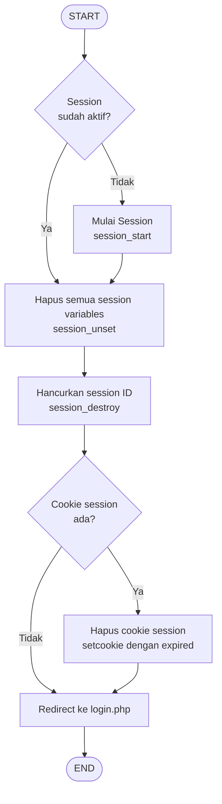

# FLOWCHART PROSES & UTILITY PAGES

Dokumentasi flowchart untuk proses-proses utility dalam sistem cafe ordering.

---

## 20. Flow Diagram Proses Tambah ke Keranjang (add_cart.php)

**Penjelasan Proses:**
1. Sistem menerima parameter `product_id` dan `qty` dari form
2. Validasi `product_id`, jika tidak valid redirect ke menu
3. Cek apakah session cart sudah ada, jika belum inisialisasi array kosong
4. Cek apakah produk sudah ada di keranjang:
   - Jika ya: tambahkan qty ke jumlah yang sudah ada
   - Jika tidak: buat entry baru dengan qty yang diberikan
5. Simpan perubahan ke session dan redirect ke halaman cart

---

## 21. Flow Diagram Proses Update Keranjang (update_cart.php)

**Penjelasan Proses:**
1. Sistem menerima parameter `action` dan `product_id`
2. Validasi `product_id`, jika tidak valid redirect ke cart
3. Proses berdasarkan action:
   - **increase**: Tambah quantity sebanyak 1
   - **decrease**: Kurangi quantity 1, jika hasil <= 0 maka hapus item
   - **delete**: Hapus item menggunakan `unset()`
   - **clear**: Kosongkan seluruh keranjang
4. Simpan perubahan ke session dan redirect kembali ke cart

---

## 22. Flow Diagram Webhook Midtrans (midtrans_notify.php)

**Penjelasan Proses:**
1. Sistem menerima HTTP POST notification dari server Midtrans
2. Parse JSON body untuk mendapatkan data transaksi
3. **Validasi Signature Key** untuk keamanan:
   - Hitung hash menggunakan server key
   - Bandingkan dengan signature yang dikirim Midtrans
   - Jika tidak cocok, tolak request dengan HTTP 400
4. Ambil `order_id` dan `transaction_status` dari notification
5. Update status order di database berdasarkan status transaksi:
   - **settlement**: Order berhasil dibayar → status 'paid'
   - **pending**: Menunggu pembayaran → status 'pending'
   - **cancel/deny/expire**: Pembayaran gagal/dibatalkan → status 'cancelled'
6. Log hasil proses dan return HTTP 200 OK ke Midtrans

---

## 23. Flow Diagram Proses Logout Admin (logout.php)

**Penjelasan Proses:**
1. Cek apakah session sudah aktif, jika belum panggil `session_start()`
2. **Hapus semua session variables** menggunakan `session_unset()`:
   - Menghapus semua variabel seperti user_id, username, role, dll
3. **Hancurkan session ID** menggunakan `session_destroy()`:
   - Menghapus file session dari server
   - Session ID tidak bisa digunakan lagi
4. (Opsional) Hapus cookie session dari browser jika ada
5. Redirect user ke halaman login.php
6. User harus login ulang untuk mengakses admin area

---

## Keterangan Simbol Flowchart

- **Oval**: Start/End
- **Persegi Panjang**: Proses/Aksi
- **Belah Ketupat**: Decision/Kondisi
- **Panah**: Alur proses
- **Persegi Panjang Sudut Membulat**: Input/Output

---

## File Terkait

1. `public/add_cart.php` - Proses tambah item ke keranjang
2. `public/update_cart.php` - Proses update dan hapus item keranjang
3. `public/midtrans_notify.php` - Webhook notification dari Midtrans
4. `admin/logout.php` - Proses logout admin

---

**Catatan:**
- Semua proses menggunakan PHP session untuk menyimpan data keranjang
- Midtrans notification handler memerlukan validasi signature untuk keamanan
- Logout process memastikan tidak ada session yang tersisa di server
